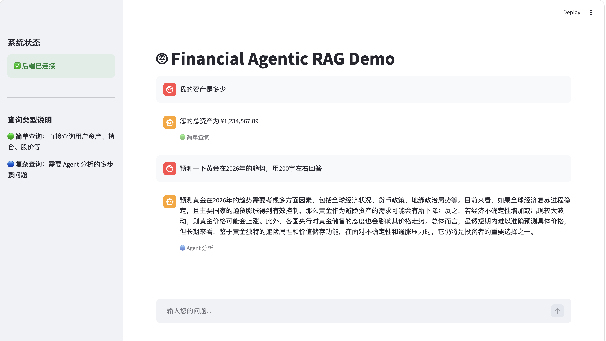

# Financial Agentic RAG

## Overview

A cost-optimized financial RAG system using LangGraph and Weaviate with a tiered LLM architecture. Routes simple queries to keyword search and complex queries through an agentic pipeline with hybrid retrieval, tool calling, and source citations.



## 🏠 Architecture

```
┌─────────────────────────────────────────────────────────────────────────────┐
│                Financial Agentic RAG (tiered LLM architecture)              │
├─────────────────────────────────────────────────────────────────────────────┤
│                                                                             │
│    input                                                                    │
│      ↓                                                                      │
│  ┌──────────────────────────────────────────────────────────────────────┐   │
│  │  Phase 1: Router (qwen-turbo)                                        │   │
│  │  - Model: qwen-turbo (cheaper)                                       │   │
│  │  - Task: intent classification with simple outputs including         │   │
│  │  "simple" and "complex"                                              │   │
│  └──────────────────────────────────────────────────────────────────────┘   │
│           │                                                                 │
│     ┌─────┴─────┐                                                           │
│     ↓           ↓                                                           │
│  Simple     Complex                                                         │
│     ↓           ↓                                                           │
│  ┌────────┐ ┌─────────────────────────────────────────────────────────┐     │
│  │Keyword │ │      Phase 2: Agent (tiered strategy)                   │     │
│  │Search  │ │                                                         │     │
│  └────────┘ │  ┌─────────────────────────────────────────────────┐    │     │
│             │  │ 2.1 Analyze Node (qwen-turbo)                   │    │     │
│             │  │ - intention analyze and sub-task dissolving     │    │     │
│             │  │ - stuctured JSON as output                      │    │     │
│             │  └─────────────────────────────────────────────────┘    │     │
│             │                         ↓                               │     │
│             │  ┌─────────────────────────────────────────────────┐    │     │
│             │  │ 2.2 Retrieve Node (no LLM calling)              │    │     │
│             │  │ - use hybrid search in phase to retrieve        │    │     │
│             │  └─────────────────────────────────────────────────┘    │     │
│             │                         ↓                               │     │
│             │  ┌─────────────────────────────────────────────────┐    │     │
│             │  │ 2.3 Tool Call Node (no LLM calling, optional)   │    │     │
│             │  │ - execute tool call                             │    │     │
│             │  │ - return tool results                           │    │     │
│             │  └─────────────────────────────────────────────────┘    │     │
│             │                         ↓                               │     │
│             │  ┌─────────────────────────────────────────────────┐    │     │
│             │  │ 2.4 Generate Node (qwen-max)                    │    │     │
│             │  │ - intergrate context and tool results           │    │     │
│             │  │ - generate final answer                         │    │     │
│             │  └─────────────────────────────────────────────────┘    │     │
│             └─────────────────────────────────────────────────────────┘     │
│                                      ↓                                      │
│            ┌─────────────────────────────────────────────────────────┐      │
│            │      Phase 3: Hybrid Search (Weaviate)                  │      │
│            │  - vector search                                        │      │
│            │  - keyword search (BM25)                                │      │
│            └─────────────────────────────────────────────────────────┘      │
│                                      ↓                                      │
│                                    output                                   │
└─────────────────────────────────────────────────────────────────────────────┘
```

### Core Features

- **Layered LLM Architecture**: Selects the appropriate model (qwen-turbo/qwen-max) based on query complexity
- **Hybrid Retrieval**: Combines vector retrieval and keyword retrieval
- **Tool Calling**: Supports dynamic tool selection and parameter formatting

## 🔥 Quick Start

### Prerequisites
- Python 3.10+
- Docker (for Weaviate)
- Qwen API key

### 🚀 Installation

```bash
git clone https://github.com/yuyuyugit/financial-agentic-rag.git
cd financial-agentic-rag
pip install -r requirements.txt
```

### Environment Setup

Create `.env` file:
```
DASHSCOPE_API_KEY=your-dashscope-api-key
WEAVIATE_URL=http://weaviate:8080
LOG_LEVEL=INFO
```

### Basic Usage

```bash
docker-compose build --no-cache
docker-compose up -d
```
Open http://localhost:8501

## ⚙️ Configuration

### Model Selection
Edit `src/config/router_config.yaml`:
```python
model: qwen-turbo
```

Edit `src/config/agent.yaml`:
```python
model:
  provider: qwen
  analyze: qwen-turbo
  generate: qwen-max
```

### Weaviate Settings

Edit `src/config/embedding.yaml`:
```python
provider: dashscope
model: text-embedding-v4
base_url: https://dashscope.aliyuncs.com/compatible-mode/v1
api_key_env: DASHSCOPE_API_KEY
```

## 📁 Project Structure

```
financial-agentic-rag/
├── src/
│   ├── agent/              # LangGraph agent pipeline
│   │   ├── graph.py        # Graph definition & compilation
│   │   ├── nodes.py        # Analyze, Retrieve, Tool Call, Generate nodes
│   │   └── state.py        # AgentState definition
│   ├── api/                # FastAPI backend
│   │   └── main.py         # API endpoints
│   ├── config/             # YAML configuration files
│   │   ├── agent.yaml
│   │   ├── embedding.yaml
│   │   ├── keyword_search_config.yaml
│   │   └── router_config.yaml
│   ├── retrieval/          # Weaviate hybrid search
│   │   ├── weaviate_client.py  # Weaviate connection
│   │   ├── hybrid_search.py    # Hybrid search logic
│   │   ├── keyword_search.py   # BM25 keyword search
│   │   └── schemas.py          # Data schemas
│   ├── router/             # Intent routing
│   │   └── intent_router.py
│   └── tools/              # Tool definitions
│       ├── portfolio.py    # Portfolio tools
│       └── stock_price.py  # Stock price tools
├── frontend/               # Streamlit UI
│   └── app.py
├── scripts/                # Setup & validation scripts
│   └── load_data.py        # Data ingestion
├── docker-compose.yml
├── Dockerfile
├── requirements.txt
└── README.md
```

## 📊 Performance

|   Scenario    |        Model         | Latency |
|---------------|----------------------|---------|
| Simple query  | qwen-turbo (keyword) |  ~200ms |
| Complex query | qwen-max (generate)  |   ~30s  |

## 🔧 Development

### Adding a New Tool

1. Define tool in `src/tools/`:
```python
def my_tool(param: str) -> str:
    """Tool description"""
    return result
```

2. Register in `src/tools/__init__.py`:
```python
TOOLS = [my_tool]
```

## 📈 Further Improvement

For detailed improvement ideas please refer to [`IMPROVEMENT_IDEAS.md`](./IMPROVEMENT_IDEAS.md).